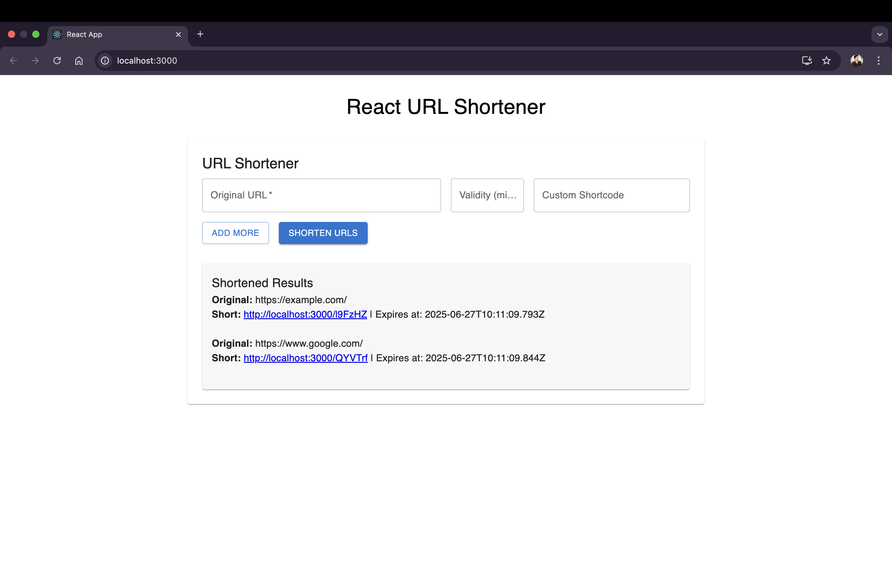

# 🚀 React URL Shortener – Frontend Test Submission

## 📝 Overview

This is a **fully functional client-side URL shortener** built using **React + TypeScript** for **Affordmed’s Campus Hiring Evaluation**.  
It supports creating short URLs with optional expiry and custom shortcodes, and features a statistics dashboard and integrated logging middleware.

---

## ✅ Features

- 🔗 Shorten **up to 5 URLs simultaneously**
- ⏳ Set an optional **validity period** (default: **30 minutes**)
- ✨ Option to add a **custom shortcode**
- 🧠 **Client-side validation** for:
  - Valid URL structure
  - Alphanumeric shortcode
  - Integer-based validity period
- 📊 **Statistics Page**:
  - Total click counts
  - Timestamp logs
  - Simulated source & location metadata
- 📋 **Custom Logging** Middleware:
  - Logs every frontend event
  - Endpoint: `http://20.244.56.144/evaluation-service/logs`
  - Format: `Log(stack, level, package, message)`
  - Implemented via `src/utils/logger.ts`

---

## ⚙️ Tech Stack

- ⚛️ **React** (TypeScript)
- 💅 **Material UI (MUI)**
- 🧭 **React Router**
- 🧱 **Custom Middleware** for logging

---

## 📁 Project Structure

Here’s a preview of the folder layout:

> 📎 The structure follows best practices with separation of concerns between components, pages, utilities, and styles.

---
